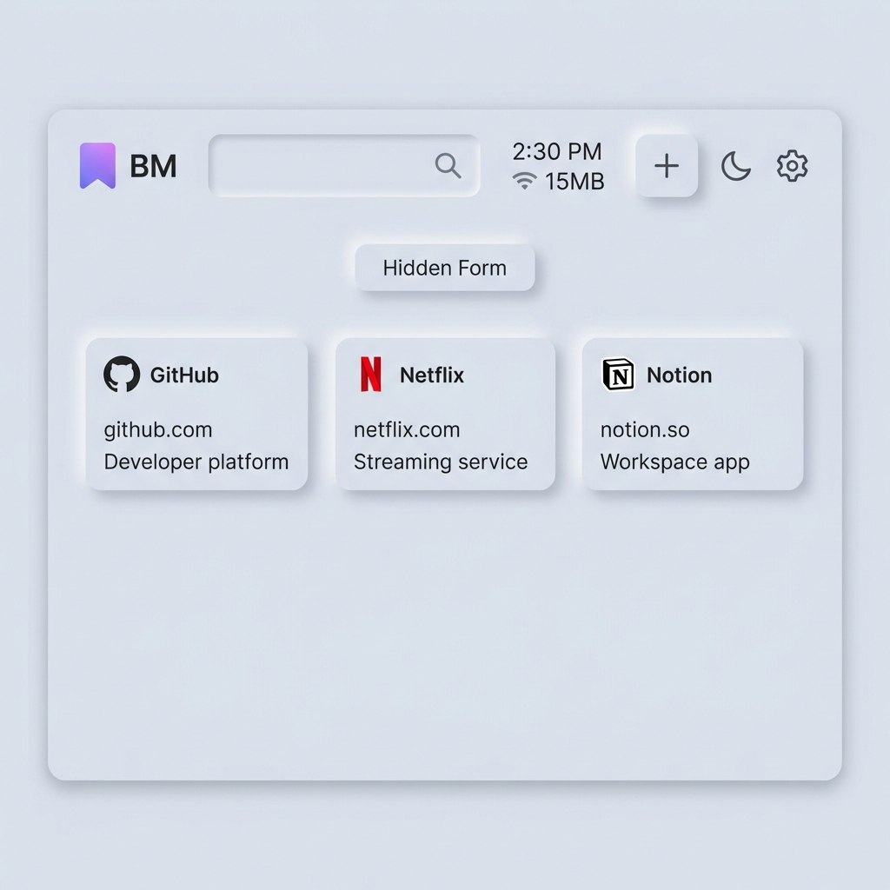
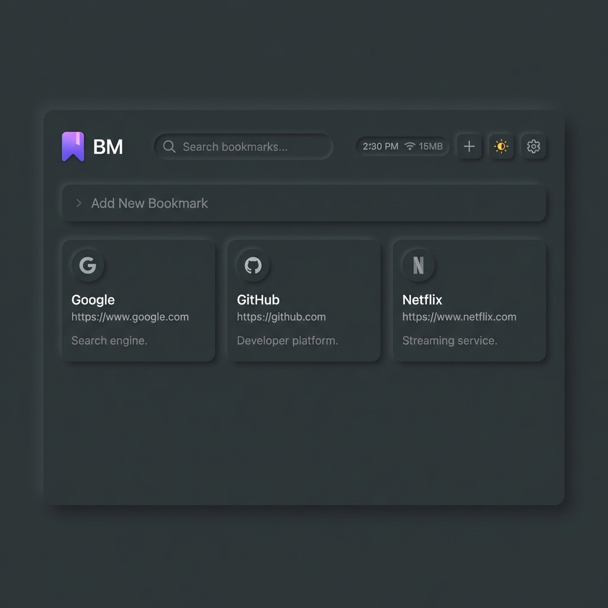
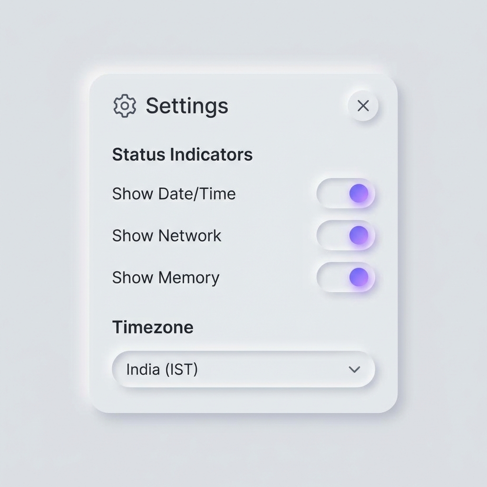

# 🔖 Bookmark Manager

A beautiful Chrome extension with a **Neumorphic UI** design for saving and organizing your favorite links.


## ✨ Features

- **Neumorphic Design** - Modern soft UI with beautiful depth and shadows
- **Dark/Light Theme** - Toggle between themes with one click
- **Auto-Fetch Metadata** - Automatically fetches title and description from URLs
- **Search** - Quickly find bookmarks by title or URL
- **IndexedDB Storage** - Reliable local storage that persists across sessions
- **New Tab Override** - Opens as your new tab page for quick access
- **Status Indicators** - Live time, network status, and memory usage display
- **Settings Modal** - Customize indicator visibility and timezone
- **Keyboard Shortcuts** - Quick actions for power users

## ⌨️ Keyboard Shortcuts

| Shortcut | Action |
|----------|--------|
| `⌘/Ctrl + K` | Focus search bar |
| `⌘/Ctrl + N` | Toggle add new bookmark form |
| `Escape` | Close add form |

## 📸 Screenshots

| Light Mode | Dark Mode |
|------------|-----------|
|  |  |

### Settings Modal



## 🚀 Installation

### From Source (Developer Mode)

1. Clone this repository:

   ```bash
   git clone https://github.com/YOUR_USERNAME/bookmark-manager-extension.git
   ```

2. Open Chrome and navigate to `chrome://extensions/`

3. Enable **Developer mode** (toggle in top right)

4. Click **Load unpacked** and select the extension folder

5. The extension will appear as your new tab page!

## 📁 Project Structure

```text
bookmark-manager/
├── manifest.json      # Extension configuration
├── popup.html         # Main UI structure
├── popup.css          # Neumorphic styles
├── popup.js           # Application logic
├── db.js              # IndexedDB wrapper
├── background.js      # Service worker for metadata fetching
├── icon16.png         # Extension icons
├── icon48.png
└── icon128.png
```

## 🛠️ Technologies

- **HTML5** - Semantic markup
- **CSS3** - Custom Neumorphic design system with CSS variables
- **JavaScript (ES6+)** - Async/await, Modules
- **IndexedDB** - Client-side storage
- **Chrome Extensions API** - Manifest V3

## 💡 Usage

1. Click the **➕** button to add a bookmark
2. Paste a URL - title and description are auto-fetched
3. Click **Add** to save
4. Use the search bar to filter bookmarks (`⌘/Ctrl + K`)
5. Hover over a bookmark and click **✕** to delete
6. Click **⚙️** to open settings and customize indicators

## ⚙️ Settings

Access via the gear icon in the header:

- **Status Indicators** - Show/hide time, network, and memory displays
- **Timezone** - Select from 10 global timezones (Local, UTC, NYC, LA, London, Paris, Tokyo, India, Dubai, Sydney)

Settings are saved to localStorage and persist across sessions.

## 🎨 Customization

The design uses CSS variables for easy customization. Edit `popup.css`:

```css
:root {
  --bg-base: #e0e5ec;      /* Base background */
  --accent-color: #6c5ce7; /* Primary accent */
  --radius-md: 20px;       /* Border radius */
}
```

## 📄 License

MIT License - feel free to use and modify!

---

Made with ❤️ by [Anirban]
